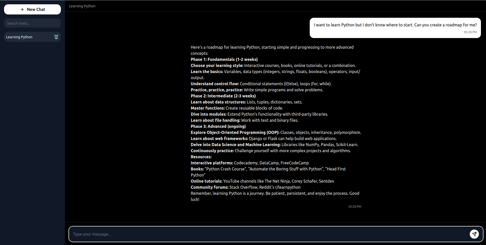

# BitSegments Local Minds

Local Minds is a lightweight, CPU-friendly conversational AI interface built on `llama-cpp-python`. It includes a memory system for personalized, context-aware interactions — even on older hardware.

##  Features

- Lightweight and optimized for CPUs (Raspberry Pi, old laptops)
- Runs local GGUF models (e.g., Gemma, Qwen)
- Long-term memory with context retrieval via `sentence-transformers`
- Multi-session chat memory support
- Minimalist yet modern front-end
- Fast boot with Flask backend

##  Project Structure

```
project/
├── app.py                # Flask backend
├── memory.py             # Memory logic with embeddings
├── requirements.txt      # Python dependencies
├── templates/
│   └── index.html        # Frontend HTML
├── static/
│   └── assets/           # Frontend
├── models/               # Place your .gguf model file here
└── memory/               # Stores session memories (auto-created)
```

##  Installation

```bash
git clone https://github.com/lynthera/bitsegments_localminds
cd bitsegments_localminds
pip install -r requirements.txt
```

You must have Python 3.10+ installed. CPU usage is default; GPU support can be enabled by changing `n_gpu_layers=-1`.

If you are using Windows, make sure that **cmake** and **nmake** are installed on your system.

##  How to Run

```bash
python app.py
```

Then visit: [http://localhost:5001](http://localhost:5001)

##  Model Setup

Place your `.gguf` model file under the `models/` directory. Please place only one model in the directory. Switching between models is not possible at the moment.

##  Memory System

The assistant uses `sentence-transformers` to embed past conversations and retrieve the most relevant memories per session.

Memory is stored in JSON files under `./memory/` by session and chat ID.

##  Requirements

- llama-cpp-python
- flask
- flask-cors
- sentence-transformers
- scikit-learn

Install via:

```bash
pip install -r requirements.txt
```

##  Screenshot


**Used Google Gemma-2-2B-IT(IQ3_M) Model**

##  Let's build together

If you have similar projects and would like to work together, contact me. I'd be happy to build something together :)
Email:beratdurak@bitsegments.com

##  License

MIT License
